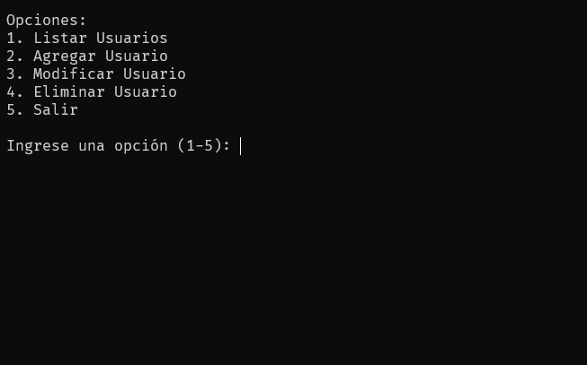

### **Aplicación de consola - CRUD Usuario**

**Versión de Python 3.11.4:**

**Instrucciones:**
- Crear un entorno virtual (Opcional)
- pip install -r requirements.txt
- python capa_datos_persona/menu_app_usuario.py

